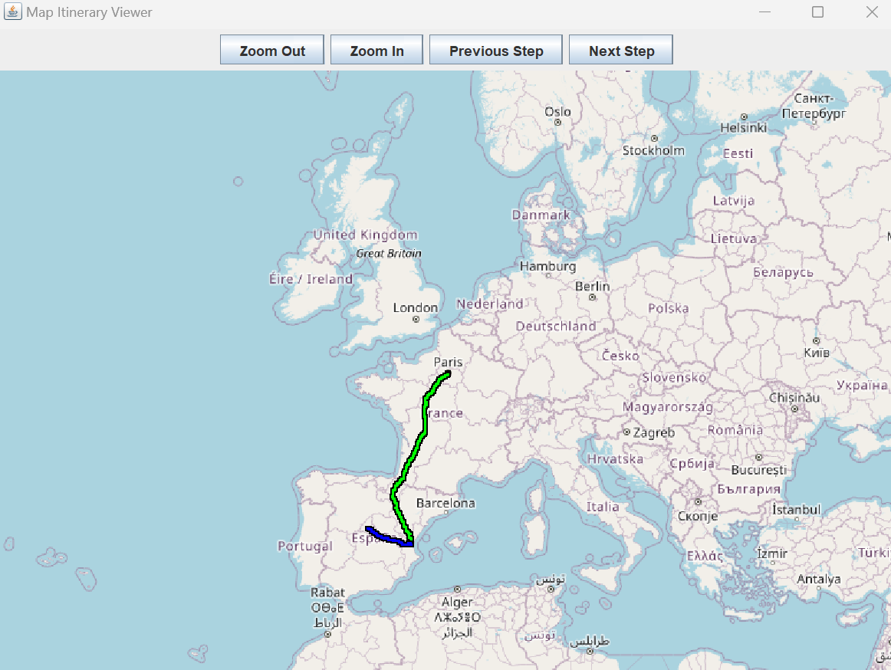

# Lets Go Biking! 🚲
School project designed to provide a convenient itinerary for cyclists traveling between two addresses with an integrated map.

The application functions as a self-hosted SOAP server on the server side, accompanied by a robust Java-based heavy client. Utilizing WCF servers, the app communicates through REST APIs and a routing service with proxy and cache, connecting seamlessly with providers like JCDecaux, Open Route Service, and Nominatim.

## Example 💻
Enter valid source and destination addresses, the app will find the nearest JCDecaux stations for you to get a bicycle. The app will then show you all the steps you have to make, from walking to the station, get a bike, travel to the next station, and arrive at your finale destination. If taking a bicycle is too long, the app will show you the shortest itinerary by walking.

Here is the app interface on the command prompt.
```
Welcome to... Lets Go Biking!

Enter origin (type 'q' to quit): paris
Enter destination: madrid
...
```
When you enter the origin and the destination, you will get the entire itinerary on the command prompt (walking and cycling steps) with all the specifications about duration and distance.

You can save your itinerary in a text file.

A map opens up for you to visualize the itinerary and each small steps.
## Map 🗺️
Resulting map from Madrid to Paris itinerary.

> [!NOTE]
> 
>  🟦 Walking
> 
>  🟩 Bicycling



# Installation ⬇️

Open git bash and clone the project folder.
```git
git clone https://github.com/marcusaasjensen/lets-go-biking.git
```
Open the cloned project folder *lets-go-biking*.

Setup your API keys in a .env file inside the Server folder.

Replace the fields by your API keys for each services and according to the following *.env.template* file.
```dotenv
OPEN_ROUTE_SERVICE_API_KEY=your_api_key
JCDECAUX_API_KEY=your_api_key
```

> [!TIP]
> You can create accounts on both services to get your API keys.
> 
> JCDecaux API key: https://developer.jcdecaux.com/
> 
> Open Route Service Api key: https://openrouteservice.org/


Open the *Server/LetsGoBiking.sln* project file with Visual Studio.

Right click on Solution and select *"Build Solution"* and wait until successful build.

> [!WARNING] 
> Make sure to use the **Java Version 11** to run the client side afterwards.
> 
> Also check if you have **maven** installed.

# Launch the app simply 🖱️
Click on the *LetsGoBiking.bat* file.

# Launch the app manually ⚙️

First, run both the Routing and the ProxyCache servers inside the associated folders:
- *Server/ProxyCacheServer/bin/Release/ProxycacheServer.exe*
- *Server/RoutingServer/bin/Release/RoutingServer.exe*

Secondly, open the command prompt in the Client folder and run in order:

```mvn
mvn clean install
mvn compile
mvn exec:java -Dexec.mainClass="com.soc.testwsclient.Main"
```

*Or (using IntelliJ)*

Open the Client project inside IntelliJ idea, and run in the local terminal: 

```mvn
mvn clean install
```

Finally, compile and run the main class.
